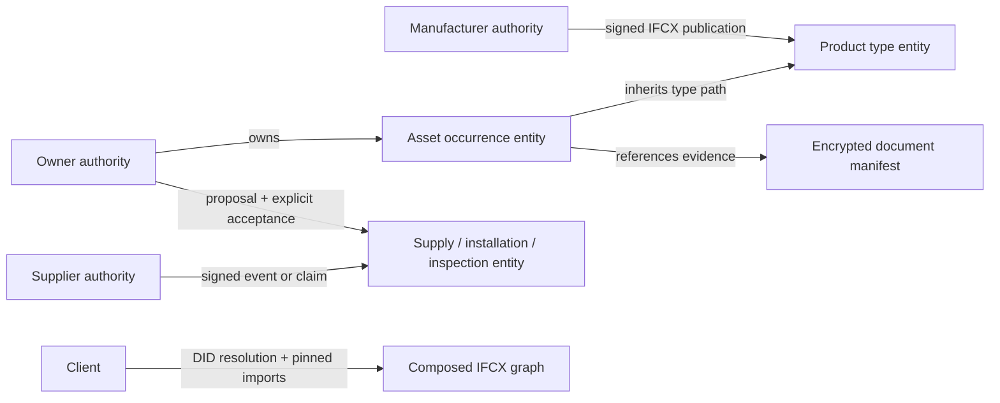

# CLIP Network And IFC Graph Architecture

## Status

IFC5/IFCX is the target canonical model for construction entities, product
types, assets, and their relationships. The current repository contains a
CLIP network and IFC graph transaction, client and operations implementation. The
v3 HTTP surface has been removed. Existing v3 data is not converted or deleted;
there is no v3 data, API, SDK or signature compatibility.

The IFCX target is pinned to buildingSMART/IFC5-development commit
`1a63082ada967c683cfacee2005f8f749c8e1b79`. That source is alpha, and its import
provider leaves validation and integrity checking as TODOs. CLIP therefore
adds a strict, documented publication profile around IFCX imports.

## Graph Model

CLIP owns identity, peer discovery, gossip, replication, document transport and
organisation-to-organisation workflows. These use `/clip/v1`, `CLIP_*` network
settings and `clip_*` infrastructure modules/tables. IFC owns graph datasets,
components, hierarchy, inheritance, entity authoring and signed graph changes.
These use `/ifc/v1` and `ifc_*` graph modules/tables. The protocol models are
separated into `clip_protocol.py` for transport/authentication and
`ifc_protocol.py` for graph transactions.

IFCX is the pinned graph serialization format, not the network protocol.
Its format-specific models, fields and schema semantics retain their IFCX names.
Neither old `/ifcx/v1` routes nor `IFCX_*` setting aliases are provided.

An IFCX path identifies an entity. Its schema-keyed `attributes` are typed
components. `children` express hierarchy; `inherits` brings type components to
an occurrence. Components do not each receive a DID. The structured IFC
component address is authority DID + dataset ID + entity path + component
schema ID.

Inspection, installation, maintenance, and similar records should be event
entities with their own typed components and references to the relevant asset,
organization, and evidence. Manufacturer product information remains in the
manufacturer-owned type entity; an owner asset can inherit it from an imported
manufacturer layer and override components locally.

Supply-chain graph reads additionally resolve verified manufacturer snapshots to
shared type nodes keyed by original manufacturer DID and product ID. This identity
survives acceptance, different supplier chains, datasets and nested assemblies.
Component-type references describe a BOM, not physical containment. The default
projection follows observed published manufacturer revisions; authorised graph
refresh pulls signed catalogues and persists their verified revisions. Pinned
views use revision-qualified nodes so distinct historical pins remain exact.
The projection does not rewrite signed IFC publications or immutable issue
snapshots. See [Supply-chain workflows](supply-chain-workflows.md#shared-manufacturer-types-and-published-updates).

Gossip and peer health are a separate CLIP operational control plane. A node
being unreachable does not alter construction facts in the IFCX graph. The
default CLIP gossip loop identifies peers by `did:web`, resolves each endpoint
from a `ClipGossipService` entry in that peer's DID document, and exchanges
signed generation digests. Indirectly learned DIDs remain `unknown`; only a
fresh, authenticated direct digest marks a peer `alive`. Enable it with
`CLIP_GOSSIP_ENABLED=true` and provide comma-separated `CLIP_GOSSIP_SEEDS` DIDs.
Disabling gossip disables membership exchange; it does not restore legacy gossip.

## Federation And Trust

Each organization controls its DID and signs its own dataset publications and
assertions. A signature proves control of a key and integrity of the signed
bytes; dataset policy separately authorizes which DIDs may propose changes.
Each dataset has an owner-managed `trustedProposers` allowlist, stored outside
the IFCX semantics; an empty list denies external proposals.

The current import profile works as follows:

1. An authority serves `/ifc/v1/datasets/{dataset-id}/publication`, containing
     the IFCX file, publisher DID, and W3C Data Integrity proof.
2. An importing IFCX file names the publication URI and pins the exact response
     bytes with SRI `sha256-<base64 digest>` in `integrity`.
3. The importer fetches over HTTPS without redirects, rejects non-public
     destinations, checks size/depth/layer limits, verifies the byte digest, then
     resolves the publisher DID and verifies its `assertionMethod` proof.
    The publisher must also be in `CLIP_TRUSTED_PUBLISHERS`.
4. Nested dependencies are composed in the pinned IFCX stack order: root first,
     imports afterward. Later layers override earlier contributions.

`integrity` is an untyped string in the pinned IFCX alpha. The SRI SHA-256
encoding above is a CLIP profile, not a claim about upstream integrity
semantics. Imported schemas and data are validated together after federation.

## Agreements

The transaction API separates assertion from authorization:

1. A trusted proposer signs a component-level proposal with an
     `assertionMethod` key. It binds the target address, schema digest, and
     expected local sequence.
2. The dataset owner separately accepts or rejects with a
     `capabilityInvocation` proof. A proposal alone never changes the graph.
3. Acceptance appends an IFCX layer contribution, increments that authority's
     local sequence, and stores a signed receipt atomically. Rejection also gets
     a signed receipt but does not advance the accepted-change sequence.

Native JSON transactions use the W3C `eddsa-jcs-2022` Data Integrity suite. The
sequence is local to one authority; there is no global ordering or consensus.

## Component Removal

The pinned composer treats `null` attribute values as values, not as component
deletion. CLIP therefore declares the versioned extension schema
`urn:clip:ifcx:component-deletions:v1`. Its array of schema IDs masks inherited
and local components after composition. A later `set` removes the schema ID
from this mask and supplies a value. The extension is inserted at dataset
registration and included in the schema digest. Other IFCX consumers must
understand this extension to reproduce CLIP's deletion behavior.

## Implemented Surface

The current `/ifc/v1` API supports:

- `POST /datasets`: register a validated IFCX file and proposer allowlist.
- `GET /datasets/{id}/publication`: retrieve the authority-signed publication.
- `PUT /datasets/{id}/trusted-proposers`: update the local authorization list.
- `POST /proposals` and `POST /decisions`: submit and decide signed component
    changes.
- `GET /datasets/{id}/components`: resolve an effective component after imports,
    inheritance, overrides, and CLIP tombstones.
- `POST /clip/v1/network/gossip/sync` and `GET /clip/v1/network/gossip/peers`:
    exchange DID-authenticated operational membership digests and inspect local
    peer health; this state is not part of an IFCX asset dataset.

The current test suite covers local graph composition, cross-authority
manufacturer type resolution, signed nested imports, integrity tampering,
proposer authorization, acceptance/rejection receipts, and component
set/remove/restore behavior.

## Replication And Evidence

`ClipReplicationService` and `ClipEvidenceService` entries advertise DID-bound
service endpoints. Service envelopes use `authentication` proofs, an exact
audience DID and a five-minute freshness window. Receiver-signed receipts are
verified before placement is acknowledged. A replica stores the owner-signed
publication and full accepted authority history without acquiring authority over
the graph. Same-digest retries are idempotent; rollback and history rewriting
are refused.

Evidence upload produces a signed manifest and an evidence reference suitable
for a normal component proposal. Every document key is sealed to a DID-resolved
X25519 recipient key. Storage nodes hold ciphertext, not plaintext keys.
Placement receipts commit to complete nonce+ciphertext bytes and retention.
Repair re-fetches missing/corrupt fragments through the recipient service and
checks the original manifest digest. Expired evidence is inaccessible and can
be physically removed with the operator retention sweep.

## Organisation-Owned Supply Chain

The `/clip/v1/supply-chain` service adds owned product definitions, supplied
offerings, deliveries, installations and recipient assets. Each local authoring
operation commits through signed graph proposals, authority decisions and
receipts. Immutable signed record revisions pin dependencies rather than
silently following an upstream latest version.

Directed issues bind selected records, dependency proofs, document digests,
recipient DID and receiving project. Recipient decisions create linked local
records without granting control over upstream records. Per-project scoped
sender approval is separate from broad Viewer/Contributor membership. Issues,
decisions, joined projects and idempotency results are persisted in appended
checksum-verified migrations.

Workflow documents are encrypted at rest and retrieved through a local broker
and DID-authenticated source grants. They are distinct from the original sealed
fragment evidence subsystem. See [Supply-chain workflows](supply-chain-workflows.md)
for the implemented console, routes and operational boundaries.

## Construction Mappings

COBie Component and Type CSV exports map to occurrence/type paths and native
`inherits` edges. Source properties and external identifiers are preserved.
IfcOpenShell parses IFC4.3 STEP into product/type paths, property sets, type
inheritance and spatial references. Geometry conversion is not included.
Event, evidence and source extensions use versioned
`urn:clip:construction:*:v1` schema identifiers, not invented buildingSMART IDs.

## Operations And Validation

Database startup applies frozen, checksum-verified numbered migrations.
Migration 9 renames infrastructure tables to `clip_*` and graph tables to
`ifc_*`, retaining rows and the checksums of revisions 1-8. Unrelated pre-IFCX
legacy tables remain untouched. Import caches retain exact byte-pinned envelopes;
corrupt bytes are removed and fetched again. DID proofs are checked on every
composition, so a cached import is not a way around key revocation.

See [Operations](operations.md) for rotation, revocation, trust, retention,
deployment and outbound DNS policy. The opt-in six-authority regression covers
restart, offline/rejoin, proof-bundle replication, stale/corrupt import recovery
and encrypted fragment repair. Conformance vectors exercise proof verification
with an independent Ed25519 implementation and composition expectations.