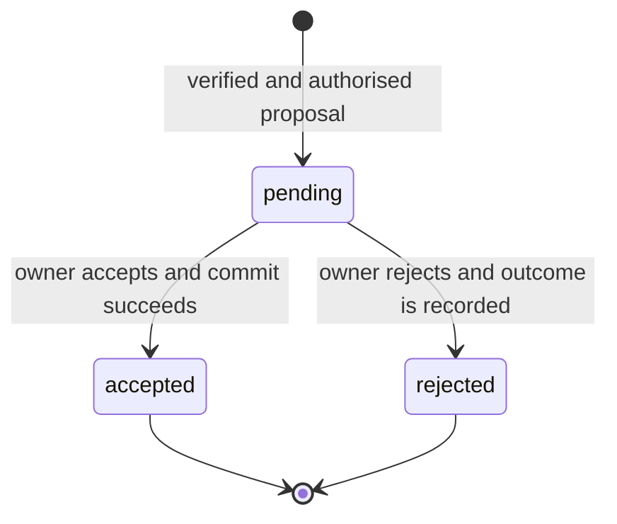

# CLIP core specification

## 1. Status and normative language

This document defines CLIP 1.0-draft.1. The key words **MUST**, **MUST NOT**,
**REQUIRED**, **SHALL**, **SHALL NOT**, **SHOULD**, **SHOULD NOT**,
**RECOMMENDED**, **NOT RECOMMENDED**, **MAY**, and **OPTIONAL** are interpreted
as in BCP 14 (RFC 2119 and RFC 8174) only when written in uppercase.

Requirements are normative **within this draft**. Differences from the research
implementation are recorded in [decisions.md](decisions.md). Numbered sections
and test IDs are stable within this document version.

## 2. Architecture

CLIP has three separable layers:

1. **Core exchange:** authority identities, verifiable assertions, decisions,
   receipts, scoped access, immutable references and local sequencing.
2. **Application profiles:** graph transactions, projects, supply-chain exchange,
   peer membership, proof-bundle replication and evidence storage.
3. **Transport bindings:** carrying the specified logical messages. The v1
   binding uses HTTPS and JSON.

An alternative transport MAY carry these JSON documents without changing their
meaning or proof coverage. An alternative encoding is not automatically
interoperable: it requires a profile defining lossless conversion to the signed
JSON representation. A replacement for IFCX requires its own graph profile,
validation rules, addresses and digest rules.

There is no global consensus or single universal owner. Each authority orders
its own accepted changes and independently decides whom to trust.

## 3. Terminology and roles

| Term | Definition |
|---|---|
| Authority | Organisation controlling a DID and its local datasets/policies |
| Actor | DID whose authorised key signs a message |
| Publisher | Authority asserting a publication, record revision or manifest |
| Proposer | Actor requesting a change to an authority-owned dataset |
| Decision authority | Authority permitted to accept or reject that proposal |
| Recipient/audience | DID to which a service exchange or business issue is addressed |
| Replica/storage peer | Independent service retaining proofs or ciphertext |
| Verifier | Component checking structure, signatures, policy and references |
| Dataset | Profile-defined collection owned by one authority |
| Project | Managed dataset with explicit access policy |
| Component | Schema-keyed value on a graph entity; not an independent DID |
| Accepted transaction | Immutable proposal/decision pair committed by its authority |
| Receipt | Authority-signed evidence of a recorded outcome |
| Revision | Immutable numbered snapshot of an authority-owned business record |
| Source pin | Reference to an exact upstream authority, record, revision and digest |

An authority MAY perform several roles. The business designation "owner" in this
specification means the dataset's decision authority, not proven legal ownership.

## 4. Identifiers and addressing

### 4.1 Identity

The v1 discovery profile MUST use `did:web` organisation identifiers. A DID
document MUST identify exactly the DID requested. Verification methods MUST be
controlled by that DID and explicitly authorised for the proof purpose.

Schemas in the prototype sometimes accept the wider `did:` prefix; this does not
constitute support for another DID method in this binding.

### 4.2 Resource identity

Dataset and record identifiers are opaque, nonempty strings. Entities are
identified by profile-defined nonempty paths. Equality is exact string equality;
implementations MUST NOT lowercase, URL-decode, trim or otherwise rewrite signed
identifiers. Transport percent-encoding is distinct from identifier identity.

The identity of a dataset is `(authorityDid, datasetId)`. The identity of a
record revision is `(authorityDid, recordId, revision)`. Matching names,
IFC classes or serial numbers do not establish equal identity across authorities.

A graph component address is:

```json
{
  "authorityDid": "did:web:owner.example",
  "datasetId": "urn:example:building",
  "entityPath": "door-01",
  "componentSchemaId": "ifc::name"
}
```

Transaction, receipt, service-message and invitation identifiers use UUID
strings in the corresponding core profiles. Senders SHOULD use lowercase,
hyphenated UUID text. Supply-chain service message IDs are historically opaque
strings; their distinct envelope is specified separately.

## 5. Trust and authority

Verification MUST distinguish:

1. **Cryptographic validity:** the document and proof have not been altered.
2. **DID authorisation:** the method belongs to the actor and is authorised for
   the specified purpose, validity interval and revocation policy.
3. **Application authorisation:** the actor may perform this operation on this
   resource at this time.
4. **Business acceptance:** a decision authority explicitly accepts a claim.

Success at one level MUST NOT imply success at the next. Discovery, gossip,
signature validity, public visibility and possession of an invitation token
MUST NOT automatically grant write permission.

Publisher trust for imports/replicas, project read membership, contributor
permission and scoped submission-sender approval are independent policies.
An empty proposer allowlist denies external proposals. New managed projects
MUST default to private unless explicitly created public.

## 6. Message processing

Before producing an operation's side effects, a receiver MUST:

1. Enforce transport and resource limits; parse unambiguous JSON.
2. Select the supported message/profile and validate required fields.
3. Resolve the actor DID and verification method.
4. Verify proof purpose, signature, key validity and revocation.
5. For service exchanges, validate audience, action/kind and freshness.
6. Validate referenced resource authority, digest and revision/sequence.
7. Evaluate current access and business policies.
8. Detect duplicate intent, identifier reuse or conflicting history.
9. Validate the entire proposed operation against the application profile.
10. Commit its state and durable outcome atomically, or reject without mutation.

Pure validation MAY be reordered to minimise work, but no side effect may precede
the checks required for it. Trust failure MUST produce an explicit failure,
not an unsigned or unverified success-shaped fallback.

A receiver MUST preserve the secured logical document used for signature and
digest verification. Deserialisation MUST NOT inject defaults, remove signed
nulls, coerce values or normalise timestamp strings before proof verification.
The model-round-trip caveat is described in [messages.md](messages.md).

## 7. Proposal and decision state machine



A proposal MUST NOT change authoritative graph state. It is a stored assertion
and requested change. The owner MUST sign a separate decision binding the exact
proposal ID and secured-document digest.

Before acceptance the authority MUST revalidate the proposal's effect,
schema precondition and current contributor permission. This draft also
requires the proposal's signing key to remain authorised at acceptance.
Rejected or accepted proposals MUST NOT later receive a conflicting decision.
Correction requires a new proposal ID; records MUST NOT be rewritten in place.

For acceptance, the following constitute one atomic durable operation:

- append the accepted proposal/decision wrapper;
- apply the graph change;
- increment the authority sequence;
- store the assertion-signed receipt;
- transition the proposal to `accepted`.

For rejection, record the decision and its assertion-signed negative receipt,
transition to `rejected`, and leave graph state and accepted-change sequence
unchanged. A negative receipt records rejection, not a failure to authenticate.

## 8. Ordering and concurrency

The graph transaction sequence is **authority-wide**, not per dataset.
It starts at zero. Each accepted graph transaction increments it by exactly one,
even if adjacent transactions concern different datasets.

Both proposal and accepting decision MUST bind the current authority sequence
in `expectedSequence`. The acceptance precondition MUST be checked atomically.
A stale proposal MUST be replaced with a newly signed proposal after review;
the authority MUST NOT edit a signed precondition.

Rejection binds the current sequence but need not match the proposal's old
sequence, because rejection does not apply its change.

Project permission revisions, business record revisions, submission revisions,
document grant revisions and gossip generations are separate counters.
They MUST NOT be substituted for `expectedSequence`. No counter implies
ordering between different authorities.

## 9. Immutability, retries and delivery

An accepted transaction, signed revision, issued submission or decided outcome
MUST be immutable. A reused identifier with different secured content MUST fail
as a conflict.

Core proposal submission and graph decisions in the prototype return conflicts
on repeats; they are not guaranteed idempotent success APIs. A client recovering
from a lost response MUST retrieve the known result before inventing another ID.

Where a profile defines an idempotency key, the receiver MUST bind it to one
exact operation intent. Same-key/same-intent retries MUST not duplicate local
records or allocations. Same-key/different-intent requests MUST fail.

Transport delivery is at-least-once at best; exactly-once network delivery is
not promised. A durable local commit and delivery of its notification are
different states. Profiles MUST expose pending delivery or failure rather than
claiming the peer received an undelivered issue/decision.

## 10. Conformance classes

| Claim | Required documents |
|---|---|
| CLIP verifier | Core, message proof/digest rules and security requirements |
| CLIP graph authority | Verifier plus IFCX graph profile and proposal state machine |
| CLIP project service | Verifier plus project read/access/invitation profile |
| CLIP supply-chain service | Verifier plus revision, issue, decision and document profile |
| CLIP gossip peer | Verifier plus discovery and gossip profile |
| CLIP proof replica | Verifier plus bundle verification and acknowledgement profile |
| CLIP evidence publisher/storage peer | Verifier plus the applicable evidence role requirements |
| CLIP HTTPS/JSON endpoint | Applicable role plus HTTPS/JSON binding |

A conformance claim MUST name document version, roles and supported profiles.
It MUST NOT imply that all optional profiles, upstream IFCX certification or
production security qualification have been completed.

## 11. Extension rules

Core v1 signed objects are closed at the outer level: unknown fields MUST be
rejected unless a versioned extension profile permits them. Payload maps and
domain-specific record `data` objects are open only where specified.

Extensions MUST NOT change the meaning of existing field names, the signed
document digest, acceptance or permission semantics. A receiver that does not
understand an operation/profile MUST reject it, not silently discard it.
Capability negotiation and a universal profile-discovery endpoint are not yet
defined; deployments MUST establish supported profiles out of band.
